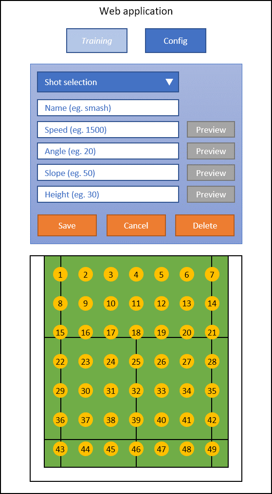

# Web application wireframe

Page when configuring a shot, after clicking on Config button

The first dropdown button lists all shots already saved for the shuttle drop target.
The trainee can select a shot from this dropdown list, which will update the values in the text box below.
Otherwise, the trainee can create a new shot targetting the selected area, by giving it a name, and the following configurations:
- Speed: The speed of the motor that determines the speed of the shuttle throw (value between 0 and 100)
- Angle: A value that determines the angle of the direction to throw the shuttle (value between 0 and 180)
- Slope: A value that determine how steep or high the shuttle will travel (value between 0 and 180)
- Height: A value that determine from which height the shuttle will be thrown (value between 0 and 40)

The Preview button runs the configuration set if there is no error.
The Stop buttin stops the preview if the preview has been launched.

If the trainee clicks on the Save button, the shot will be saved in the SD card and can be used during the training session.
If the shot name already exists, the configuration will overwrite the previous one.
If the training clicks on the Cancel button, the configuration will be reset.
If the trainee clicks on delete, the shot will be deleted from the SD card.
If the shot name does not exist, the button delete must be disabled.
